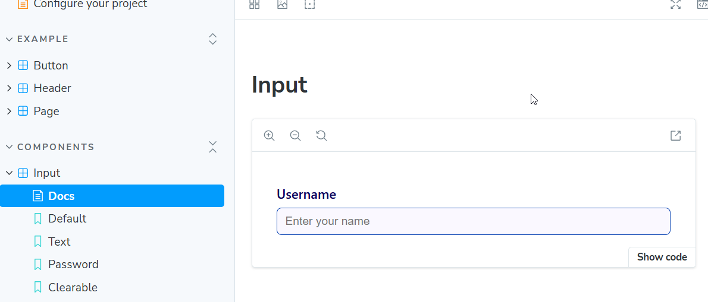
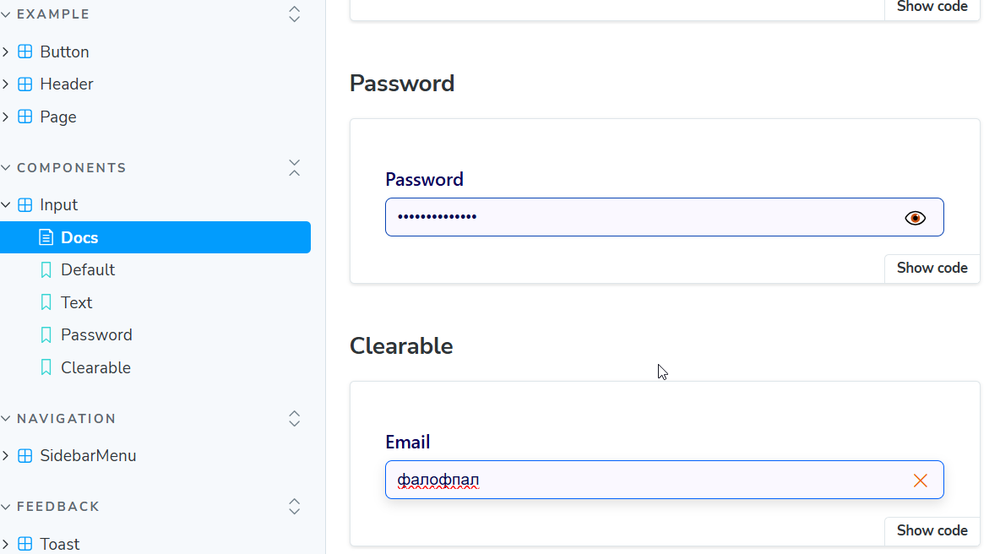
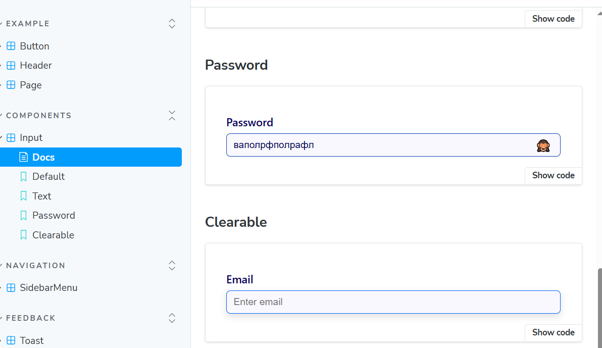
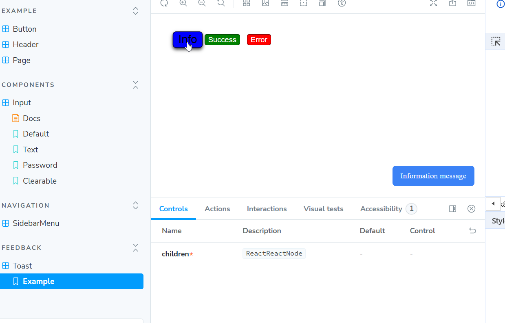
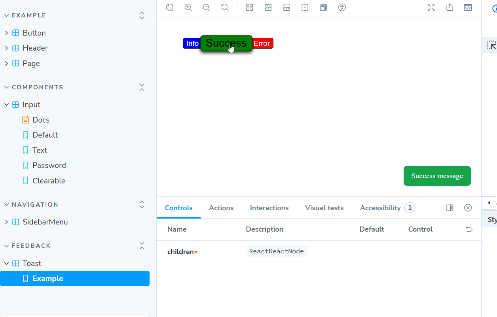
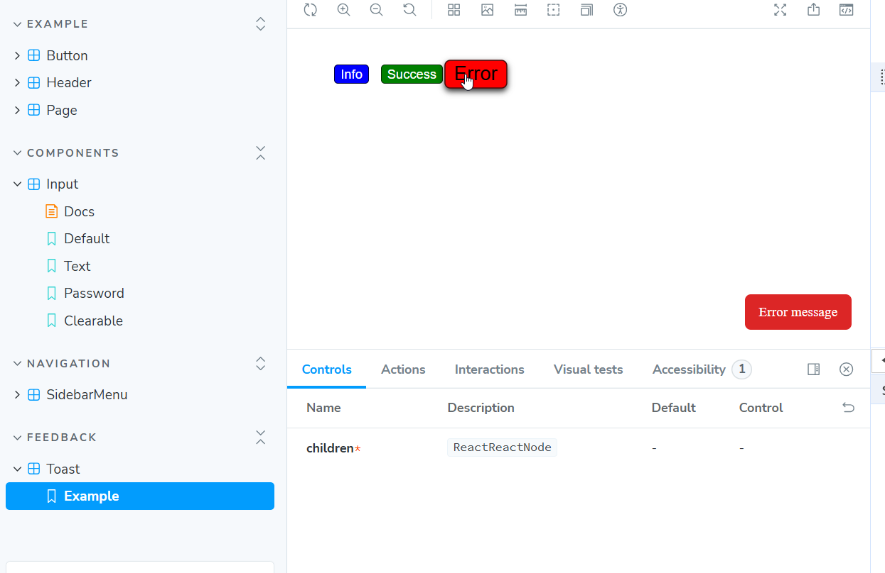
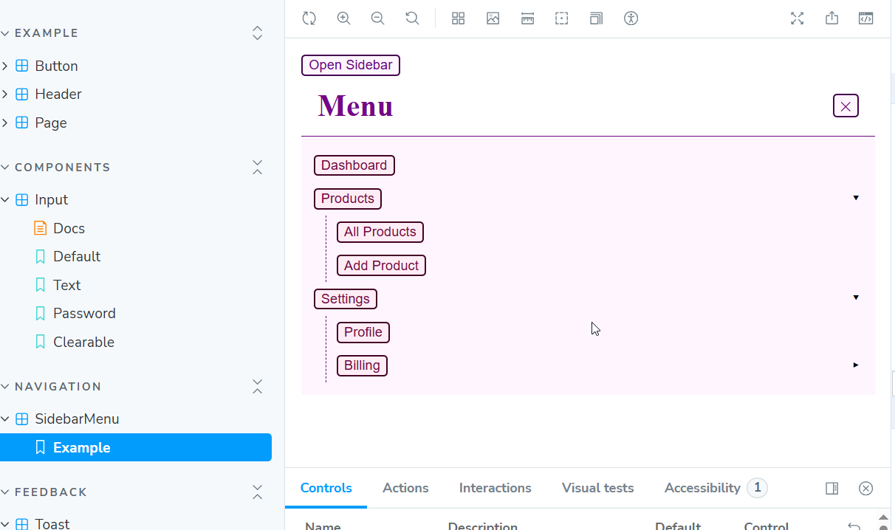

# 💛💙 UI Component Library

This project is a small library of UI components built using Next.js and Storybook.
It demonstrates an approach to building reusable interface elements with a clear structure, typing, and an isolated environment for viewing components

This is a [Next.js](https://nextjs.org) project bootstrapped with [`create-next-app`](https://nextjs.org/docs/app/api-reference/cli/create-next-app).

This is a [Storybook](https://storybook.js.org/addons/storycap#install)

## 🧩Technologies

### ⚛️ Next.js

— framework for React applications

### 📘 Storybook

— tool for documenting and testing UI components

### 💅 CSS

— basic component styling without libraries

### 🔷 TypeScript

— static typing for code reliability

## 📦 Installation

Clone the repository and install the dependencies:

git clone https://github.com/your-username/your-project.git
cd your-project
npm install

## ▶️ Project launch

Run Next.js in development mode:

npm run dev

After that, open:
👉 http://localhost:3000

## 📖 Launching Storybook

Launch Storybook to view components:

npm run storybook

Then open in the browser:
👉 http://localhost:6006

## 🧱 Структура проєкту

<pre>```.
├── components/ # UI components
│ ├── Button/
│ ├── Input/
│ └── Toast/
├── stories/ # Storybook stories for components
├── pages/ # Next.js pages
├── public/ # Static resources
├── package.json
└── README.md```</pre>

# 🧱 UI Component Library

The easiest way to deploy your Next.js app is to use the [Vercel Platform](https://vercel.com/new?utm_medium=default-template&filter=next.js&utm_source=create-next-app&utm_campaign=create-next-app-readme) from the creators of Next.js.

Check out our [Next.js deployment documentation](https://nextjs.org/docs/app/building-your-application/deploying) for more details.

## 🧱 UI Component Library

# Examples input

Input default


Input state 1


Input state 2


## Examples toast

Toast info


Toast success


Toast error


## Examples sidebar

Sidebar state 1


Sidebar state 2

